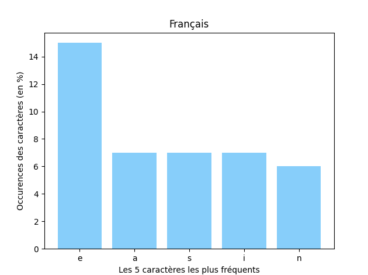

# APP3
## Sujet
Cet apprentissage par projet n°3 consiste à analyser les occurrences de lettres dans des textes dont on connait la 
langue pour ensuite pouvoir déduire la langue de n'importe quel texte. 

- Les consignes se trouvent ici : [APP3_sujet.pdf](APP3_sujet.pdf)
- Les textes de réferences se trouvent ici : [textes](textes)

## But
- **Apprendre** à programmer et se servir de l'algorithme de **tri par comptage**.
- Travailler dans un environnement semblable à un environnement **professionnel**.

## Installation
Ce projet dépend d'une bibliothèque qui n'est pas installé nativement avec `Python`. Pour l'installer, 
exécuter la commande :
- Windows
```bash
pip install -r requirements.txt
```
- MacOS & Linux
```bash
pip3 install -r requirements.txt
```

## Execution
Pour démarrer le programme il suffit d'exécuter le fichier python `main.py`
- Windows
```bash
python main.py
```
- MacOS & Linux
```bash
python3 main.py
```

## Changer le texte à analyser
Le texte que l'algorithme ce trouve dans le fichier `text.txt`. 
```text
Adiós ríos, adiós fontes,
Adiós regatos pequenos,
Adiós vista dos meus ollos,
Non sei cándo nos veremos.
```

Vous pouvez modifier son contenu pour analyser un autre texte.

## Présentation
Une présentation **PowerPoint** pour bien présenter le sujet et les algorithmes utilisés est disponible ici :
- [APP3.ppsx](presentation/APP3.ppsx)
- [APP3.pdf](presentation/APP3.pdf)

## Modifications
Vous pouvez afficher, lors de l'exécution du programme, **l'histogramme des lettres les plus communes** de chaque langue

<p align="center">
  
</p>

Pour cela, vous devez modifier les lignes suivantes du fichier `main.py`
```python
# True pour afficher les histogrammes.
SHOW_HIST = True

# False pour ne pas l'afficher.
SHOW_HIST = False
```

Vous pouvez également modifier le **nombre de lettres les plus communes** que l'algorithme utilisera :
```python
NUM_MOST_FREQ_CHAR = 5  # 5 est la valeur par défaut.
```

## Ajout d'une langue
Pour le moment, l'algorithme est capable de **distinguer 7 langages** :
- Français
- Anglais
- Portuguais
- Espagnol
- Allemand
- Italien
- Néerlandais

Néanmoins, il est possible **d'ajouter une langue** simplement en ajoutant le ou les textes associés dans le dossier
`textes` et d'ajouter le chemin de votre ou vos textes dans le fichier `language_analysis/FILE_PATHS.py`.
```python
LANGUAGE_TEXT_PATH = {
    'Français': ('textes/fables_.txt', 'textes/lacomediehumaine_.txt'),
    'Anglais': ('textes/richardIII_.txt', 'textes/hamlet_.txt', 'textes/mobydick_.txt'),
    'Portugais': ('textes/osmaias_.txt', 'textes/lusiadas_.txt'),
    'Espagnol': ('textes/donquijote_.txt',),
    'Allemand': ('textes/faust_.txt',),
    'Italien': ('textes/ladivinecomedie_.txt',),
    'Néerlandais': ('textes/deondergangdereerstewareld_.txt',),
    # 'Langue': ('textes/nom_du_fichier1.txt', 'textes/nom_du_fichier2.txt'),
}
```
## Licence
- romainflcht